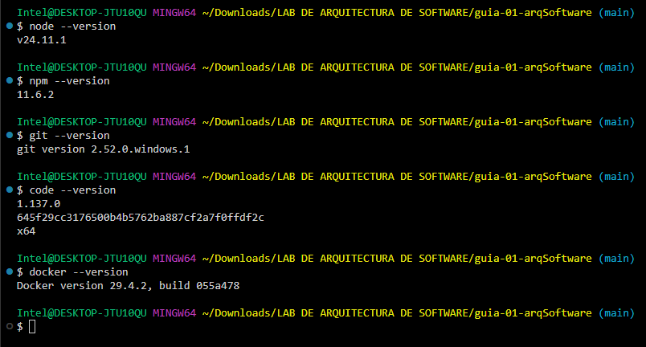
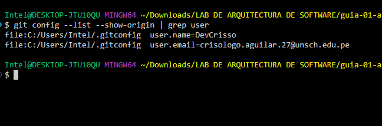
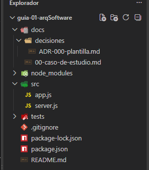

# Guía 01 — Arquitectura de Software IS-488

<div align="center">


</div>

---

## 👤 Estudiante
**Crisólogo Aguilar Flores**  
Ingeniería de Sistemas — UNSCH, Ayacucho, Perú

## 👩‍🏫 Docente
**Ing. Lizbeth Jaico Quispe**

---

## 📖 Descripción del curso

IS-488 Arquitectura de Software aborda las decisiones estructurales que
definen cómo se organiza, escala y mantiene un sistema de software.
Desde la configuración del entorno hasta patrones arquitectónicos aplicados
en proyectos reales.

## 🎯 Expectativas

- Aprender a tomar decisiones arquitectónicas con criterio técnico.
- Dominar Git y GitHub como herramientas profesionales de trabajo en equipo.
- Construir sistemas bien estructurados desde el primer día de desarrollo.
- Preparar una base sólida para mi camino hacia el backend y la ciberseguridad.

---

## ✅ Evidencias del laboratorio

### Paso 01 — Verificación de versiones y entorno

| Herramienta | Versión detectada |
|-------------|-------------------|
| Node.js | v24.11.1 |
| npm | 11.6.2 |
| Git | 2.52.0.windows.1 |
| VS Code | 1.137.0 |
| Docker | 29.4.2 |



---

### Paso 02 — Configuración de identidad en Git

```bash
git config --global user.name "DevCrisso"
git config --global user.email "crisologo.aguilar.27@unsch.edu.pe"
```



---

## 🗂️ Estructura del proyecto
